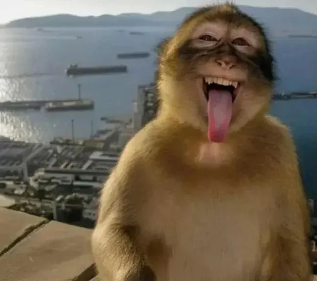
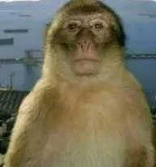
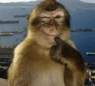

# 🐵 Monkey Meme Image Descriptions

This document describes the monkey meme images used in the Monkey Expression Matcher app.

---

## ToungeOut (Happy Expression)

- **Expression Mapping**: Happy 😄
- **Pose**: Facing forward and sitting upright.
- **Eyes**: Squinting and narrowed as if in mid-laugh.
- **Facial expression**: Playful and silly; the mouth is wide open with the tongue sticking out significantly.
- **Hand position**: Hands are lowered and positioned out of the main frame.

---

## HandsOnChest_shocked_MouthOpen (Surprised Expression)

- **Expression Mapping**: Surprised 😲
- **Pose**: Facing forward, sitting upright and looking directly at the camera.
- **Eyes**: Very wide, rounded, and staring forward with a look of shock or disbelief.
- **Facial expression**: Intensely surprised or gasping; the mouth is wide open in an "O" shape, with the tongue and teeth visible.
- **Hand position**: Both hands are clasped together and held tightly against the center of the chest.

---

## Thinking (Neutral Expression)

- **Expression Mapping**: Neutral 😐
- **Pose**: Facing forward and sitting upright.
- **Eyes**: Looking upward and slightly to the side.
- **Facial expression**: Contemplative or thoughtful; the mouth is slightly open.
- **Hand position**: The right hand is raised to the face with a finger resting near the mouth or chin, as if in deep thought.

---

## Neutral (Sad Expression)

- **Expression Mapping**: Sad 😢
- **Pose**: Facing forward and sitting upright.
- **Eyes**: Looking directly at the camera with a steady, neutral gaze.
- **Facial expression**: Neutral or stoic; the mouth is closed in a relatively straight line.
- **Hand position**: Both hands are lowered and mostly out of the frame, resting at the sides.

---

## HandsOnChest_shocked_MouthClosed (Angry Expression)

- **Expression Mapping**: Angry 😠
- **Pose**: Facing forward directly toward the camera in an upright position.
- **Eyes**: Wide, bulging, and looking slightly to the side with a startled or "shocked" gaze.
- **Facial expression**: An expression of extreme surprise or being scandalized, with the mouth slightly agape and the brow appearing raised.
- **Hand position**: Both hands are clasped together and clutched tightly against the center of the chest.

---

## Idea (Fearful Expression)

- **Expression Mapping**: Fearful 😨
- **Pose**: Facing forward, sitting upright.
- **Eyes**: Narrowed slightly and looking upward with a sense of realization or joy.
- **Facial expression**: A broad, toothy grin showing a full set of teeth.
- **Hand position**: The right hand is raised with the index finger pointing straight up, as if having a sudden idea or making a point.

---

## ThinkSmirking (Disgusted Expression)

- **Expression Mapping**: Disgusted 🤢
- **Pose**: Facing forward and sitting upright.
- **Eyes**: The right eye is closed in a wink, while the left eye is open and looking forward.
- **Facial expression**: A knowing or mischievous smirk; the mouth is slightly upturned.
- **Hand position**: The right hand is raised with a finger touching the chin, complementing the winking expression.
